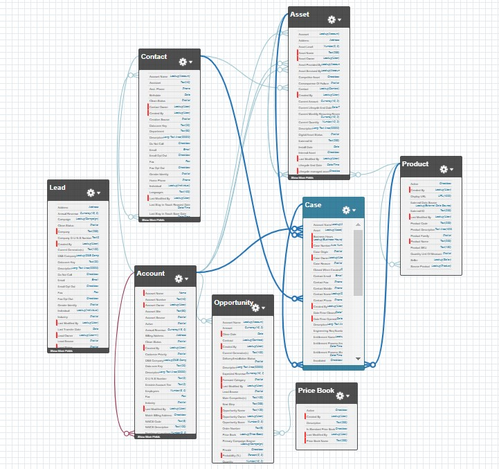

# **ProContacto - Evaluación Práctica**
> Una interesante forma de resolver ejercicios prácticos propuesto por ProContacto
> 

J. Jordan D. Godoy
Desarrollador

> [!NOTE]
> No era consciente de la importancia de los archivos README hasta antes de toparme con esta evaluación práctica, ya siento que comienzo a aprender desde el momento cero.

## Ejercicios 
> A continuación se encuentran todos los ejercicios propuestos por ProContacto.

### Ejercicio 1
  1. Instalar el IDE Visual Studio Code:
    <br></br>
    
    <br></br>
  2. Instalar GIT y GIT Bash:
    <br></br>
    
    <br></br><br></br><br></br>
> Instalados ambos programas


### Ejercicio 2
  1. **¿Qué es un servidor HTTP?**  
      Es una computadora que tiene un programa o servicio que almacena, procesa y entrega recursos web a una página en base a solicitudes mediante el protocolo HTTP.
  2. *¿Qué son los verbos HTTP? Mencionar los más conocidos*  
      * Son los métodos que definen las acciones que se pueden ejecutar en una comunicación HTTP, por ejemplo:
        * *GET:* Obtener datos de un recurso.
        * *POST:* Enviar datos para un nuevo recurso.
        * *PUT:* Actualizar datos de un recurso existente.
        * *DELETE:* Elimina los datos de un recurso.
  3. *¿Qué es un request y un response en una comunicación HTTP? ¿Qué son los headers?*  
      * *Request:* Es la solicitud que envía un cliente al servidor.
      * *Response:* Es la respuesta que recibe el cliente del servidor.
      * *Headers:* Es la información adicional que se envían en el _request_ y en el _response_ que proporcionan información sobre la solicitud o respuesta, por ejemplo, el tipo del contenido, tamaño, autenticación, etc.
  4. *¿Qué es una queryString? (En el contexto de una URL)*  
      Es la parte de la URL que que se encuentra después de *?*, estos son parámetros compuestos por pares de _clave-valor_ los cuales se usan para pasarle información al servidor.
  5. *¿Qué es el responseCode? ¿Qué significado tienen los posibles valores devueltos?*  
      Son los códigos de estado posibles que tienen las solicitudes, esto representa el estado de la respuesta de la solicitud. Por ejemplo:
        * *Cód. 200:* OK.
        * *Cód. 404:* Not Found.
        * *Cód. 500:* Internal Server Error
        * *Cód. 401:* Unauthorized
  6. *¿Cómo se envía la data en un GET y cómo en un POST?*  
      En un *GET* se envían los datos mediante la URL como parámetros en el _queryString_ y en un *POST* los datos se envían en el _body_ de la solicitud. 
  7. *¿Qué verbo HTTP utiliza el navegador cuando accedemos a una página?*  
      Se usa el verbo *GET* cuando accedemos a una página web mediante el navegador.
> [!IMPORTANT]
> El verbo *GET* es el verbo por defecto que se utiliza cuando no es especificado por la solicitud.
  8. *Explicar brevemente qué son las estructuras de datos JSON y XML dando ejemplo de estructuras posibles*  
   **JSON (JavaScript Object Notation):** Es un formato de intercambio de datos fácil de leer y de escribir. Ejemplo:
   ```
      {
      "nombre": "Jordan",
      "apellido": "Godoy",
      "correo": "jjordandg96@gmail.com",
      "edad": 28,
      "contratar": true
      }
   ```
   **XML (eXtensible Markup Language):** Es un formato más estructurado y formal, usado para representar datos, es parecido a HTML. Ejemplo:

   ```
      <candidato>
        <nombre>Jordan</nombre>
        <apellido>Godoy</apellido>
        <correo>jjordandg96@gmail.com</correo>
        <edad>28</edad>
        <contratar>true</contratar>
      </candidato>
   ```
  9. *Explicar brevemente el estándar SOAP*  
      *SOAP (Simple Object Access Protocol):* Es un protocolo basado en XML que dicta cómo intercambiar mensajes estructurados entre aplicaciones a través de redes, usado mayormente en servicios web. Ofrece un alto nivel de seguridad y permite transacciones complejas.
  10. *Explicar brevemente el estándar RESTful*  
      *REST (REpresentational State Transfer):* Es una técnica de arquitectura de software que ayuda a crear una forma de pensar y contruir APIs. Separa a cliente y servidor, haciendo ambas partes independientes. Es un protocolo sin estado, cada petición HTTP debe contener toda la información necesaria para poder ser resuelta.
  11. *¿Qué son los headers en un request? ¿Para qué se utiliza el key Content-Type en un header?*  
      Los *headers* en un request son campos extra que proporcionan información sobre una solicitud, como por ejemplo, el tipo de cliente o el formato de los datos.
      El *header _Content-Type_* se usa para indicar el tipo de contenido que se está enviado o se espera recibir. Por ejemplo _application/json_. 

### Ejercicio 3
  1. Realizamos un request GET a la URL: https://procontacto-reclutamiento-default-rtdb.firebaseio.com/contacts.json
        
  2. Realizamos un request POST a la URL: https://procontacto-reclutamiento-default-rtdb.firebaseio.com/contacts.json
        
  3. Volvemos a realizar un request GET a la URL: https://procontacto-reclutamiento-default-rtdb.firebaseio.com/contacts.json
        
> Se puede observar, que el POST hecho en el **punto 2** ahora se ve reflejado
       
### Ejercicio 4
  [Ver mi perfil de Trailhead](https://www.salesforce.com/trailblazer/t5dhro8lc2mqbpqhmj)

### Ejercicio 5  
  1. **Lead**  
     Un _Lead_ representa una persona o una organización con interes en los productos o servicios de la organización, pero aún no es un cliente potencial.  
     **Datos estándar:** _Name, Company, Phone, Email, Industry, Lead Source, Status, Rating, Owner._  
     Se relaciona con los objetos _Account, Contact y Opportunity_.  
  2. **Account**  
     Un _Account_ representa una empresa o una entidad con la empresa que tiene una relación.  
     **Datos estándar:** _Name, Account Number, Industry, Website, Phone, Type, Billing Address, Number of Employees, Annual Revenue, Ownership, Account Source, Parent Account, Owner._  
     Se relaciona directamente con _Contacts_ que son las personas en esa organización, también con _Opportunity_ que son las ventas relacionadas con ese cliente. También se relacionan con los _Assets_ que son los activos del cliente y con _Cases_ que son los soportes del cliente.   
  3. **Contact**  
     Un _Contact_ representa una persona dentro de una cuenta de la empresa.  
     **Datos estándar:**  _First Name, Last Name, Account Name, Title, Phone, Email, Departament, Mailing Address, Birthdate, Lead Source, Owner._  
     Se relaciona directamente con _Accounts_ y también puede estar relacionado a múltiples _Opportunity_ y _Case_.  
  4. **Opportunity**  
     Un _Opportunity_ es una posible venta o negocio que se produce con un _Account_  
     **Datos estándar:**  _Opportunity Name, Account Name, Stage, Close Date, Amount, Probability, Lead Source, Type, Next Step, Owner._  
     Se relaciona a un _Account_, pueden incluir varios _Contact_ con _Quotes_ y _Products_.  
  5. **Product**  
     Un _Product_ represeta bienes o servicios que ofrece la organización.  
     **Datos estándar:** _Product Name, Product Code, Description, Product Family, IsActive, Quantity, Revenue Schedule, Cost, Standard Price._  
     Se relaciona con los _PriceBooks_ y se pueden agregar a _Opportunity_ y _Quotes_ lo cual definden los productos que ofrece la organización.  
  6. **PriceBook**  
     Es una lista de precios que contiene una colección de productos.  
     **Datos estándar:** _Price Book Name, Description, IsActive._  
     Se relacionan directamente con  _Products_. También, cada _Opportunity_ y _Quote_ usan un _PriceBook_.  
  7. **Quote**  
     Un _Quote_ es una propuesta que detalla los productos, precios y condiciones que se ofrecen a un cliente en una oportunidad de venta.  
     **Datos estándar:** _Quote Name, Opportunity Name, Quote Number, Status, Expiration Date, Description, Price Book, Tax, Discount, Total Price, Owner._  
     Un _Quote_ se relaciona directamente con _Opportunity_ y usa un _PriceBook_ para definir los precios cotizados.  
  8. **Asset**  
     Un _Asset_ representa un producto o servicio que un cliente compró a la cual, la organización le debe ofrecer soporte y/o mantenimiento.  
     **Datos estándar:** _Asset Name, Account Name, Product, Serial Number, Install Date, Purchase Date, Usage End Date, Status, Quantity, Price, Owner._  
     Un _Asset_ se relaciona con _Account_, ya que es el cliente que posee el producto o servicio, y también se pueden relacionar con _Case_ si el cliente solicita soporte.  
  9. **Case**  
     Un _Case_ es un registro de una solicitud de soporte reportado por un cliente.  
     **Datos estándar:** _Case Number, Account Name, Contact Name, Status, Priority, Origin, Type, Subject, Description, Reason, Owner._  
     Un _Case_ se vincula con _Account_ y con _Contact_, dado que las personas de las organizaciones clientes son quienes hacen pedidos de soporte. También se puede relacionar con _Asset_ si el pedido de soporte está relacionado con un producto o servicio.  
  10. **Article**  
     Un _Article_ es un artículo de Salesforce, que se usa para ayudar a resolver problemas de los clientes.  
     **Datos estándar:** _Title, Summary, Article Number, URL Name, Article Type, Last Published Date, Owner, Article Body, Keywords, Expiration Date._  
     Un _Article_ no está relacionado directamente con otros objetos, pero los _Case_ pueden dar uso a los _Article_ para ayudar en la asistencia al usuario.  
      
      <br><br>
> Diagrama de las relaciones de los objetos


### Ejercicio 6  

#### Soluciones de Salesforce
  - **¿Qué es Salesforce?**  
    + Salesforce es una plataforma de software en la nube que ofrece soluciones de gestion de relaciones con los clientes (CRM), este ayuda a las empresas a gestionar y automatizar sus procesos. Dado que es una solución en la nube, permite acceder a la información desde cualquier lugar facilitando el trabajo de sus clientes.  
  - **¿Qué es Sales Cloud?**  
    + Sales Cloud es uno de los productos de Salesforce fabricado especialmente para optimizar procesos de ventas.  
  - **¿Qué es Service Cloud?**  
    + Service Cloud es una solución enfocada en mejorar el servicio y soporte al cliente.   
  - **¿Qué es Health Cloud?**  
    + Health Cloud es una plataforma de Salesforce enfocada en el sector de la salud.  
  - **¿Qué es Marketing Cloud?**  
    + Marketing Cloud es una plataforma de Salesforce enfocada en mejorar y optimizar estrategias de marketing digital.


#### Funcionalidades de Salesforce

  - **¿Qué es un RecordType?**
    * Es una configuración que permite personalizar el comportamiento de un objeto según distintos tipos de registros. 
  - **¿Qué es un ReportType?**
    * Es una plantilla que define qué objetos y campos están disponibles en un reporte.  
  - **¿Qué es un Page Layout?**
    * Es la configuración que define la disposición de campos, secciones y botones en una página de un registro. 
  - **¿Qué es un Compact Layout?**
    * Es el diseño simplificado de campos clave que se muestra en dispositivos móviles.   
  - **¿Qué es un Perfil?**
    * Es la configuración que define los permisos de acceso y control sobre objetos, campos y funciones de Salesforce para sus usuarios.   
  - **¿Qué es un Rol?**
    * Es la estructura que define la jerarquía de acceso y visibilidad de datos.  
  - **¿Qué es un Validation Rule?**
    * Es una regla que valida la entrada de datos en un campo, asegura que esta entrada de datos cumple con ciertos criterios para guardarse.
  - **¿Qué diferencia hay entre una relación Master Detail y Lookup?**
    * _Master-Detail_ es una relación de dependencia fuerte entre registros, con control de permisos y eliminación en cascada.
    * _Lookup_ es una relación más flexible, sin dependencia total entre registros.
  - **¿Qué es un Sandbox?** 
    * Es un entorno de pruebas aislado de producción donde los desarrolladores pueden realizar tests sin afectar los datos reales.    
  - **¿Qué es un ChangeSet?**
    * Es una colección de cambios que se pueden enviar de un entorno de Salesforce a otro.   
  - **¿Para qué sirve el import Wizard de Salesforce?**
    * Sirve para importar datos en masa a Salesforce desde archivos   
  - **¿Para qué sirve la funcionalidad Web to Lead?**
    * Es para capturar automáticamente prospectos de un formulario web y crear registros de los clientes potenciales (_leads_) en Salesforce.   
  - **¿Para qué sirve la funcionalidad Web to Case?**
    * Es capturar solicitudes de soporte desde un formulario web, creando casos automáticamente en Salesforce para su seguimiento.   
  - **¿Para qué sirve la funcionalidad Omnichannel?**
    * Es para gestionar y asignar solicitudes de clientes desde distintos canales como, chat y correo electrónico, a los agentes disponibles para mejorar la eficiencia del soporte.    
  - **¿Para qué sirve la funcionalidad Chatter?**
    * Es una herramienta de chat en Salesforce que permite a los empleados enviar mensajes, compartir archivos y trabajar en equipo dentro de la plataforma.
   
#### Conceptos generales  

  - **¿Qué significa SaaS?**  
    * SaaS _(Software as a Service)_ es un modelo de software donde las aplicaciones se hostean en la nube y se acceden mediante internet. Los usuarios no necesitan instalar o mantener el software.

  - **¿Salesforce es SaaS?**  
    * Salesforce es una solución de SaaS ya que es plataforma de CRM (Customer Relationship Management) alojada en la nube.

  - **¿Qué significa que una solución sea Cloud?**  
    * Una solución en la nube _(Cloud)_ es aquella que se aloja en servidores remotos y se accede a través de internet. Permite a los usuarios almacenar, gestionar y procesar datos de forma remota, sin depender de infraestructura propia.

  - **¿Qué significa que una solución sea On-Premise?**  
    * Una solución _On-Premise_ es aquella que se instala y se ejecuta en los servidores y la infraestructura de la propia empresa.  

  - **¿Qué es un pipeline de ventas?**  
    * Un _pipeline_ de ventas es una representación visual de las etapas de una venta, desde el contacto inicial hasta su cierre.  

  - **¿Qué es un funnel de ventas?**  
    * Un _funnel_ de ventas es un proceso por el cual un cliente potencial pasa por varias etapas (conocimiento, interés, decisión y acción) hasta convertirse en cliente.  

  - **¿Qué significa Customer Experience?**  
    * _Customer Experience_ es la percepción que tiene un cliente sobre una empresa, basada en las interacciones que tiene con ella.  

  - **¿Qué significa omnicanalidad?**  
    * La _omnicanalidad_ es una estrategia que permite a los clientes interactuar con una empresa mediante de múltiples canales (físicos y digitales) de manera integrada y fluida, lo cual produce una experiencia continua.  

  - **¿Qué significa que un negocio sea B2B? ¿Qué significa que un negocio sea B2C? ¿Qué es un KPI?**  
    * _B2B (Business-to-Business):_ Es un modelo de negocio en el que las transacciones se realizan entre empresas.  
    * _B2C (Business-to-Consumer):_ Es un modelo de negocio donde una empresa vende directamente a consumidores finales.  
    * _KPI (Key Performance Indicator):_ Es un indicador clave de desempeño que se utiliza para medir el éxito de una actividad o proceso en una empresa.  

  - **¿Qué es una API y en qué se diferencia de una Rest API?**  
    * _API (Application Programming Interface):_ Es un conjunto de reglas que permite que dos aplicaciones se comuniquen entre sí.  
    * _REST API:_ Es un tipo de API que sigue las convenciones del estilo arquitectónico REST, usando métodos HTTP (GET, POST, PUT, DELETE) para realizar operaciones en recursos identificables por URLs.  

  - **¿Qué es un Proceso Batch?**  
    * Un _Proceso batch_ es un conjunto de tareas que se ejecutan de manera secuencial y sin intervención del usuario. Suele utilizarse para procesar grandes volúmenes de datos o realizar tareas repetitivas.  

  - **¿Qué es Kanban?**  
    * _Kanban_ es una metodología visual de gestión de proyectos que usa tarjetas y tableros para representar las tareas en proceso.  

  - **¿Qué es un ERP?**  
    * _ERP (Enterprise Resource Planning)_ es un sistema de planificación de recursos empresariales que integra y gestiona procesos de negocio.  

  - **¿Salesforce es un ERP?**
    * Salesforce **NO** es un ERP. Es principalmente un CRM, centrado en la gestión de relaciones con clientes y ventas, aunque ofrece módulos para integrarse con sistemas ERP.


### Ejercicio 7  


 
