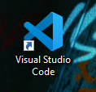
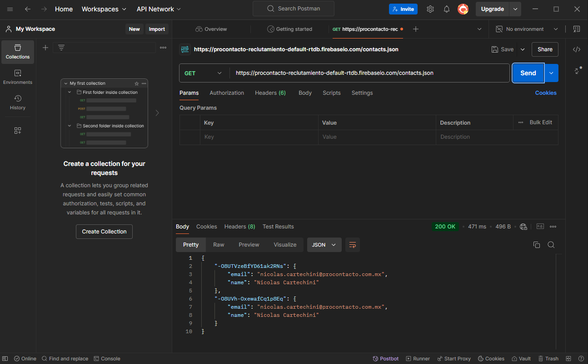
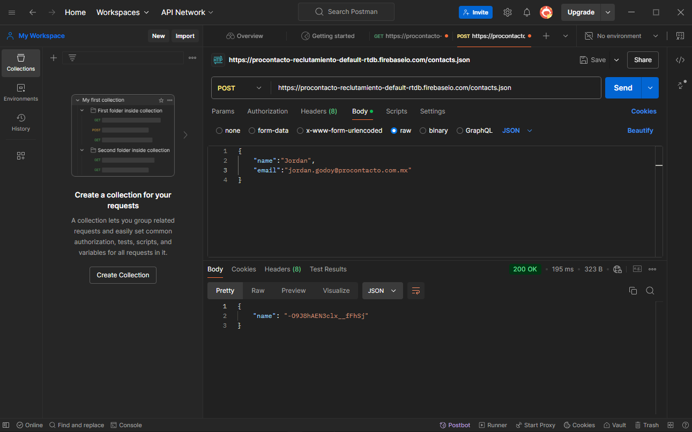
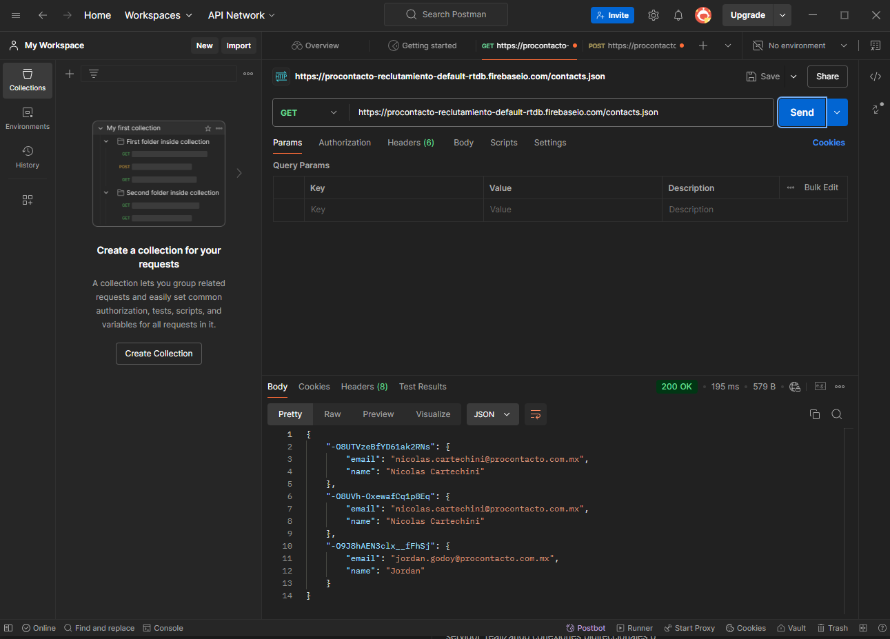

# ProContacto - Evaluación Práctica
> Una interesante forma de resolver ejercicios prácticos propuesto por ProContacto
> 

J. Jordan D. Godoy
Desarrollador web FullStack

> [!NOTE]
> No era consciente de la importancia de los archivos README hasta antes de toparme con esta evaluación práctica, ya siento que comienzo a aprender desde el momento cero.

## Ejercicios 
> A continuación se encuentran todos los ejercicios propuestos por ProContacto.

### Ejercicio 1
  - 1. Instalar el IDE Visual Studio Code:
    
  - 2. Instalar GIT y GIT Bash:
    
    <br></br><br></br><br></br>
> Instalados ambos programas


### Ejercicio 2
  - 1. **¿Qué es un servidor HTTP?**  
      Es una computadora que tiene un programa o servicio que almacena, procesa y entrega recursos web a una página en base a solicitudes mediante el protocolo HTTP.
  - 2. *¿Qué son los verbos HTTP? Mencionar los más conocidos*  
      * Son los métodos que definen las acciones que se pueden ejecutar en una comunicación HTTP, por ejemplo:
        * *GET:* Obtener datos de un recurso.
        * *POST:* Enviar datos para un nuevo recurso.
        * *PUT:* Actualizar datos de un recurso existente.
        * *DELETE:* Elimina los datos de un recurso.
  - 3. *¿Qué es un request y un response en una comunicación HTTP? ¿Qué son los headers?*  
      * *Request:* Es la solicitud que envía un cliente al servidor.
      * *Response:* Es la respuesta que recibe el cliente del servidor.
      * *Headers:* Es la información adicional que se envían en el _request_ y en el _response_ que proporcionan información sobre la solicitud o respuesta, por ejemplo, el tipo del contenido, tamaño, autenticación, etc.
  - 4. *¿Qué es una queryString? (En el contexto de una URL)*  
      Es la parte de la URL que que se encuentra después de *?*, estos son parámetros compuestos por pares de _clave-valor_ los cuales se usan para pasarle información al servidor.
  - 5. *¿Qué es el responseCode? ¿Qué significado tienen los posibles valores devueltos?*  
      Son los códigos de estado posibles que tienen las solicitudes, esto representa el estado de la respuesta de la solicitud. Por ejemplo:
        * *Cód. 200:* OK.
        * *Cód. 404:* Not Found.
        * *Cód. 500:* Internal Server Error
        * *Cód. 401:* Unauthorized
  - 6. *¿Cómo se envía la data en un GET y cómo en un POST?*  
      En un *GET* se envían los datos mediante la URL como parámetros en el _queryString_ y en un *POST* los datos se envían en el _body_ de la solicitud. 
  - 7. *¿Qué verbo HTTP utiliza el navegador cuando accedemos a una página?*  
      Se usa el verbo *GET* cuando accedemos a una página web mediante el navegador.
> [!IMPORTANT]
> El verbo *GET* es el verbo por defecto que se utiliza cuando no es especificado por la solicitud.
  - 8. *Explicar brevemente qué son las estructuras de datos JSON y XML dando ejemplo de estructuras posibles*  
    *JSON (JavaScript Object Notation):* Es un formato de intercambio de datos fácil de leer y de escribir. Ejemplo:
      ```
      {
      "nombre": "Jordan",
      "apellido": "Godoy",
      "correo": "jjordandg96@gmail.com",
      "edad": 28,
      "contratar": true
      }
      ```
    *XML (eXtensible Markup Language):* Es un formato más estructurado y formal, usado para representar datos, es parecido a HTML. Ejemplo:
      ```
      <candidato>
        <nombre>Jordan</nombre>
        <apellido>Godoy</apellido>
        <correo>jjordandg96@gmail.com</correo>
        <edad>28</edad>
        <contratar>true</contratar>
      </candidato>
      ```
  - 9. *Explicar brevemente el estándar SOAP*  
      *SOAP (Simple Object Access Protocol):* Es un protocolo basado en XML que dicta cómo intercambiar mensajes estructurados entre aplicaciones a través de redes, usado mayormente en servicios web. Ofrece un alto nivel de seguridad y permite transacciones complejas.
  - 10. *Explicar brevemente el estándar RESTful*  
      *REST (REpresentational State Transfer):* Es una técnica de arquitectura de software que ayuda a crear una forma de pensar y contruir APIs. Separa a cliente y servidor, haciendo ambas partes independientes. Es un protocolo sin estado, cada petición HTTP debe contener toda la información necesaria para poder ser resuelta.
  - 11. *¿Qué son los headers en un request? ¿Para qué se utiliza el key Content-Type en un header?*  
      Los *headers* en un request son campos extra que proporcionan información sobre una solicitud, como por ejemplo, el tipo de cliente o el formato de los datos.
      El *header _Content-Type_* se usa para indicar el tipo de contenido que se está enviado o se espera recibir. Por ejemplo _application/json_. 

### Ejercicio 3
   - 1. Realizamos un request GET a la URL: https://procontacto-reclutamiento-default-rtdb.firebaseio.com/contacts.json
        
   - 2. Realizamos un request POST a la URL: https://procontacto-reclutamiento-default-rtdb.firebaseio.com/contacts.json
        
   - 3. Volvemos a realizar un request GET a la URL: https://procontacto-reclutamiento-default-rtdb.firebaseio.com/contacts.json
        
        * Se puede observar, que el POST hecho en el **punto 2** ahora se ve reflejado
       
### Ejercicio 4
    [Visita mi perfil de Trialhead público con este enlace](https://www.salesforce.com/trailblazer/t5dhro8lc2mqbpqhmj)


 
